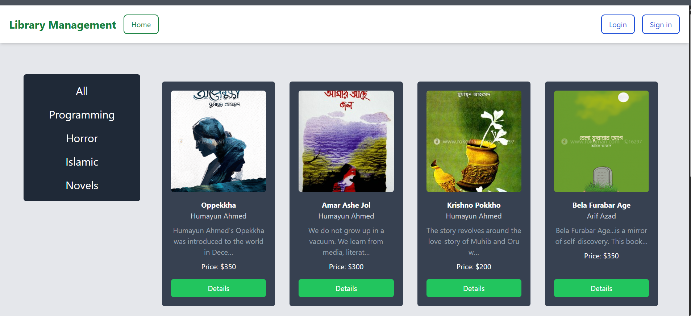
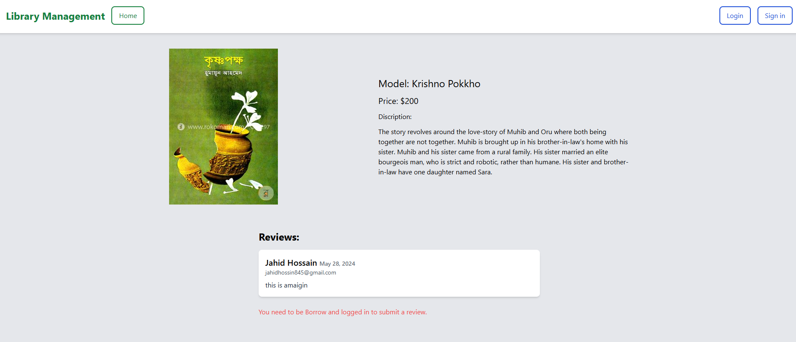

# 📚 Library Management System

A web application built with **Django** that simplifies how a library manages its books, members and borrowing. Users can create an account, browse books by category, borrow and return books, and track their transactions.

🔗 **Live Demo:** [https://librarymanagementproject-7xbp.onrender.com/](https://librarymanagementproject-7xbp.onrender.com/)

> ℹ️ The live site is hosted on Render's free tier, so the first load may take 30–60 seconds while the server wakes up.

---

## 📸 Home page



## 📸 Details Book



---

## ✨ Features

- 🏠 **Home page** with all books shown as cards (cover image, title, author, short description, price)
- 🗂️ **Category-wise filtering** from the sidebar: All, Programming, Horror, Islamic, Novels
- 📖 **Book details page** for full information about each book
- 🔐 **User authentication:** register, login and logout
- 🔄 **Borrow & return** books
- 💳 **Transaction tracking** for every user
- 📱 **Responsive UI** built with Tailwind CSS
- 🛠️ **Django admin panel** for managing books, categories and users

---

## 🧰 Tech Stack

| Layer | Technology |
|-------|------------|
| Language | Python 3 |
| Backend Framework | Django (MVC pattern) |
| Frontend | HTML, Django Templates, Tailwind CSS |
| Database | SQLite (local development), PostgreSQL-ready (`psycopg2`, `dj-database-url`) |
| Forms | django-crispy-forms, crispy-tailwind, crispy-bootstrap5 |
| Tailwind Integration | django-tailwind, django-tailwindcss |
| Static/Asset handling | django-compressor, django-browser-reload |
| Config | django-environ |
| Deployment | [Render.com](https://render.com) |
| Version Control | Git & GitHub |

---

## 🚀 Installation & Setup (Local)

### Prerequisites

Make sure these are installed on your computer:

- [Python 3.10+](https://www.python.org/downloads/)
- [Git](https://git-scm.com/downloads)
- pip (comes with Python)

### 1. Clone the repository

```bash
git clone https://github.com/shorafothoshen/LibraryManagementProject.git
cd LibraryManagementProject
```

### 2. Create and activate a virtual environment

**Windows**
```bash
python -m venv venv
venv\Scripts\activate
```

**macOS / Linux**
```bash
python3 -m venv venv
source venv/bin/activate
```

### 3. Install dependencies

```bash
pip install -r requirements.txt
```

> ⚠️ Kichu package (jemon `PyAutoGUI`, `opencv-contrib-python`, `MouseInfo`) desktop-related. Install e jhamela hole oigulo `requirements.txt` theke remove kore abar install koro, project chalate lagbe na.

### 4. Apply database migrations

```bash
python manage.py makemigrations
python manage.py migrate
```

### 5. Create a superuser (admin)

```bash
python manage.py createsuperuser
```

### 6. Run the development server

```bash
python manage.py runserver
```

Ebar browser-e open koro 👉 **http://127.0.0.1:8000/**

Admin panel 👉 **http://127.0.0.1:8000/admin/** (superuser diye login koro, then books & categories add koro)

---

## 🎨 Tailwind CSS (Optional)

Jodi Tailwind-er style change korte chao, Node.js install thakle:

```bash
npm install
npx tailwindcss -i ./static/css/input.css -o ./static/css/output.css --watch
```

> Tomar project-e Tailwind-er input/output file path alada hole command-e path ta change kore nio.

---

## ☁️ Deployment on Render

Ei project ta Render.com e deploy kora ache. Nijer deploy korte hole:

1. Code GitHub-e push koro.
2. [Render Dashboard](https://dashboard.render.com/) → **New +** → **Web Service**.
3. GitHub repository connect koro.
4. Settings:
   - **Build Command:** `pip install -r requirements.txt && python manage.py migrate`
   - **Start Command:** `gunicorn Library_management.wsgi:application`
5. **Environment Variables** add koro (jemon `SECRET_KEY`, `DEBUG=False`, `DATABASE_URL`).
6. **Create Web Service** click koro.

> 📌 Production-e `gunicorn` (ar static file-er jonno `whitenoise`) `requirements.txt`-e thakte hobe. Na thakle add kore nio.

---

## 🔄 How It Works

1. Visitor homepage-e sob book dekhte pare.
2. Sidebar theke category select korle shudhu oi category-r book dekhay.
3. User account create kore login kore.
4. Book-er **Details** e giye book borrow kore.
5. Book return korle transaction record update hoy.

---

## 🗺️ Future Improvements

- 🔍 Search bar (title / author diye search)
- 💰 Online payment integration
- ⏰ Due date & fine system
- 📧 Email notification
- ⭐ Book review & rating
- 📊 Admin dashboard with reports

---

## 🤝 Contributing

1. Repository **Fork** koro
2. New branch banao: `git checkout -b feature/your-feature`
3. Changes commit koro: `git commit -m "Add your feature"`
4. Push koro: `git push origin feature/your-feature`
5. **Pull Request** open koro

---

## 👨‍💻 Author

**Shorafot Hoshen**
GitHub: [@shorafothoshen](https://github.com/shorafothoshen)

---

⭐ Project ta bhalo lagle GitHub-e ekta **star** dite bhulo na!
